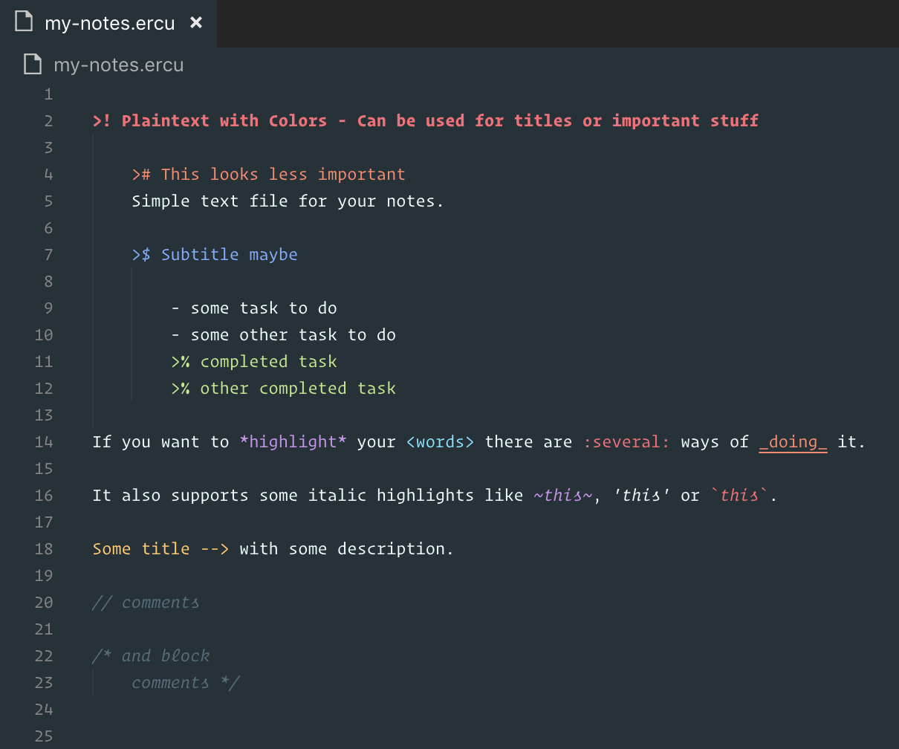

# VSCode Extension for Plaintext with Colors
_`.ercu`_ is an enriched plaintext format. It is the regular text file with some coloring.

If you like to take notes in simple text files and all you need is just some colors, give it a try.

Please note that the colors will change depending on your VSCode theme. 

| Syntax     |
|------------|
| >!         |
| >#         |
| >$         |
| >%         |
| --> text   |
| \< text \> |
| * text *   | 
| ~ text ~   |
| \_ text \_ |
| 'text'     |
| \` text \` |
| : text :   |
| // text    |
| /* text */ |

### Example
